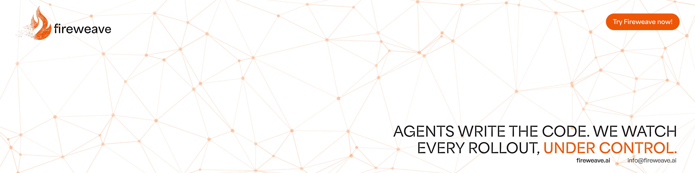

<a href="https://app.fireweave.ai">
  <picture>
    <source media="(prefers-color-scheme: dark)" srcset=".github/assets/banner-dark.png">
    <source media="(prefers-color-scheme: light)" srcset=".github/assets/banner-light.png">
    
  </picture>
</a>

<p align="center">
  <a href="https://www.npmjs.com/package/@fireweaveai/server-sdk"></a>
  <a href="https://www.npmjs.com/package/@fireweaveai/web-sdk"></a>
  <a href="https://pypi.org/project/fireweave/"></a>
  <a href="https://pkg.go.dev/github.com/FireWeave-HQ/fireweave-sdk/sdks/go/v2"></a>
  <a href="https://central.sonatype.com/artifact/ai.fireweave/fireweave-sdk"></a>
  <a href="https://crates.io/crates/fireweave"></a>
  <a href="sdks/swift"></a>
  <a href="sdks/dart"></a>
</p>

**Fireweave is the AI release engineer for teams shipping with coding agents.** Every change rolls out behind a control point, one step at a time, with guardrails watching real users — and if something breaks, Fireweave pauses or rolls it back before most users ever see it. It's the only way to ship as fast as your agents write code, without the fear of breaking production.

## Quick start

<details>
<summary><b>Node.js</b> · Bun · Deno</summary>

```bash
npm install @fireweaveai/server-sdk
# bun add @fireweaveai/server-sdk  ·  deno add npm:@fireweaveai/server-sdk
```

```ts
import { initFireweave } from '@fireweaveai/server-sdk';

const fireweave = await initFireweave({
  mode: 'remote',
  apiUrl: process.env.FW_API_URL!,
  apiKey: process.env.FW_PROJECT_API_KEY!,
});

// Once per user: the facts your targeting rules match on.
await fireweave.registerTarget('user_42', { kind: 'user', properties: { plan: 'pro' } });

// Per request: evaluate a control point.
const enabled = await fireweave.controlPoints.getBooleanValue('new-checkout', false, {
  targetingKey: 'user_42',
});
console.log('new-checkout:', enabled);

await fireweave.shutdown();
```

</details>

<details>
<summary><b>Web</b> (browser)</summary>

```bash
npm install @fireweaveai/web-sdk
```

```ts
import { initFireweave } from '@fireweaveai/web-sdk';

const fireweave = await initFireweave({
  mode: 'remote',
  apiUrl: 'https://app-server.fireweave.ai',
  apiKey: 'YOUR_PROJECT_API_KEY',
});

// Register the user, then fetch their decisions.
await fireweave.identify('user_42', { kind: 'user', properties: { plan: 'pro' } });

// Reads are synchronous: safe inside a render path.
const enabled = fireweave.controlPoints.getBooleanValue('new-checkout', false);
console.log('new-checkout:', enabled);

await fireweave.shutdown();
```

</details>

<details>
<summary><b>Python</b></summary>

```bash
pip install fireweave
```

```python
import os

from fireweave import EvaluationContext, RegisterTargetOptions, init_fireweave

client = init_fireweave(
    mode="remote",
    api_url=os.environ["FW_API_URL"],
    api_key=os.environ["FW_PROJECT_API_KEY"],
)

# Once per sign-in: the durable facts your targeting rules match on.
client.register_target(
    "user_42", RegisterTargetOptions(kind="user", properties={"plan": "pro"})
)

# Per request.
enabled = client.control_points.get_boolean_value(
    "new-checkout", False, EvaluationContext("user_42")
)
print("new-checkout:", enabled)

client.shutdown()
```

</details>

<details>
<summary><b>Go</b></summary>

```bash
go get github.com/FireWeave-HQ/fireweave-sdk/sdks/go/v2
```

```go
package main

import (
	"context"
	"fmt"
	"log"
	"os"

	"github.com/FireWeave-HQ/fireweave-sdk/sdks/go/v2/fireweave"
)

func main() {
	client, err := fireweave.Init(fireweave.Options{
		Mode:   fireweave.ModeRemote,
		APIURL: os.Getenv("FW_API_URL"),
		APIKey: os.Getenv("FW_PROJECT_API_KEY"),
	})
	if err != nil {
		log.Fatal(err)
	}
	defer client.Runtime().Shutdown(context.Background())

	// Once per login: the durable facts your targeting rules match on.
	client.RegisterTarget("user_42", &fireweave.RegisterTargetOptions{
		Kind:       fireweave.TargetKindUser,
		Properties: map[string]any{"plan": "pro"},
	})

	// Per request: evaluate a control point.
	user := fireweave.NewEvaluationContext("user_42", nil)
	enabled := client.ControlPoints().GetBooleanValue("new-checkout", false, &user)
	fmt.Println("new-checkout:", enabled)
}
```

</details>

<details>
<summary><b>Java</b></summary>

```xml
<dependency>
  <groupId>ai.fireweave</groupId>
  <artifactId>fireweave-sdk</artifactId>
  <version>2.3.0</version>
</dependency>
```

```java
import ai.fireweave.sdk.application.Fireweave;
import ai.fireweave.sdk.application.FireweaveClient;
import ai.fireweave.sdk.application.InitOptions;
import ai.fireweave.sdk.application.RegisterTargetOptions;
import ai.fireweave.sdk.domain.EvaluationContext;
import ai.fireweave.sdk.domain.JsonValue;
import ai.fireweave.sdk.domain.TargetKind;

public class Quickstart {
    public static void main(String[] args) {
        // remote(apiKey, apiUrl): the SDK never reads env vars itself
        InitOptions options = InitOptions.remote(
                System.getenv("FW_PROJECT_API_KEY"), System.getenv("FW_API_URL"));

        try (FireweaveClient client = Fireweave.init(options)) {
            client.registerTarget("user_42", RegisterTargetOptions.builder()
                    .kind(TargetKind.USER)
                    .property("plan", JsonValue.of("pro"))
                    .build());

            boolean enabled = client.controlPoints().getBooleanValue("new-checkout", false,
                    EvaluationContext.builder().targetingKey("user_42").build());
            System.out.println("new-checkout = " + enabled);
        }
    }
}
```

</details>

<details>
<summary><b>Rust</b></summary>

```bash
cargo add fireweave
```

```rust
use fireweave::{
    init_fireweave, EvaluationContext, InitOptions, RegisterTargetOptions, TargetKind,
};

fn main() -> Result<(), Box<dyn std::error::Error>> {
    let client = init_fireweave(InitOptions::remote(
        std::env::var("FW_PROJECT_API_KEY")?,
        std::env::var("FW_API_URL")?,
    ))?;

    // Once per login: the facts your targeting rules match on.
    let target = RegisterTargetOptions {
        kind: Some(TargetKind::User),
        properties: Some([("plan".into(), "pro".into())].into_iter().collect()),
        ..Default::default()
    };
    client.register_target("user_42", Some(&target));

    let ctx = EvaluationContext::new().with_targeting_key("user_42");
    let enabled = client
        .control_points
        .get_boolean_value("new-checkout", false, Some(&ctx));
    println!("new-checkout: {enabled}");

    client.shutdown();
    Ok(())
}
```

</details>

<details>
<summary><b>Swift</b> · iOS · macOS</summary>

```bash
# Not on a registry yet: clone next to your package
git clone --branch swift/v2.2.0 https://github.com/FireWeave-HQ/fireweave-sdk
```

```swift
// Package.swift (swift-tools-version: 6.0)
platforms: [.macOS(.v13), .iOS(.v16)],
dependencies: [.package(path: "../fireweave-sdk/sdks/swift")],
// in your target
dependencies: [.product(name: "Fireweave", package: "swift")]
```

```swift
import Fireweave
import Foundation

let env = ProcessInfo.processInfo.environment
let fireweave = try await initFireweave(.remote(InitFireweaveRemoteOptions(
    apiKey: env["FW_PROJECT_API_KEY"] ?? "",
    apiUrl: env["FW_API_URL"] ?? ""
)))

// Once per login: register the target, then prefetch its decisions.
_ = await fireweave.identify("user_42", options: RegisterTargetOptions(
    kind: .user, properties: ["plan": "pro"]
))

// Reads are synchronous lookups in that prefetched cache.
let enabled = fireweave.controlPoints.getBooleanValue("new-checkout", default: false)
print("new-checkout: \(enabled)")

await fireweave.shutdown()
```

</details>

<details>
<summary><b>Dart</b> · Flutter (Android, iOS, macOS, Windows, Linux, web) · Dart VM</summary>

```yaml
# Not on pub.dev yet: clone next to your app and depend on it by path
dependencies:
  fireweave:
    path: ../fireweave-sdk/sdks/dart
```

```dart
import 'package:fireweave/fireweave.dart';

final fw = await initFireweave(InitFireweaveOptions.remote(
  apiKey: 'project-api-key_...',
  apiUrl: 'https://app-server.fireweave.ai',
  context: EvaluationContext(targetingKey: deviceId), // prefetch under a stable key
));

// Once per login: register the target, then prefetch its decisions.
await fw.identify('user_42',
    options: const RegisterTargetOptions(properties: {'plan': 'pro'}));

// Inside build(): synchronous, never throws.
final enabled = fw.controlPoints.getBooleanValue('new-checkout', false);

await fw.shutdown();
```

</details>
